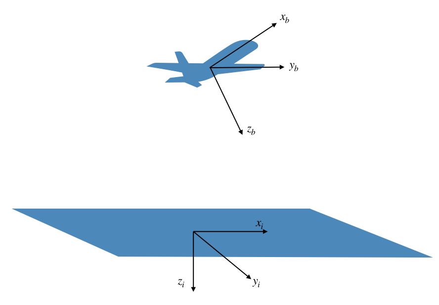
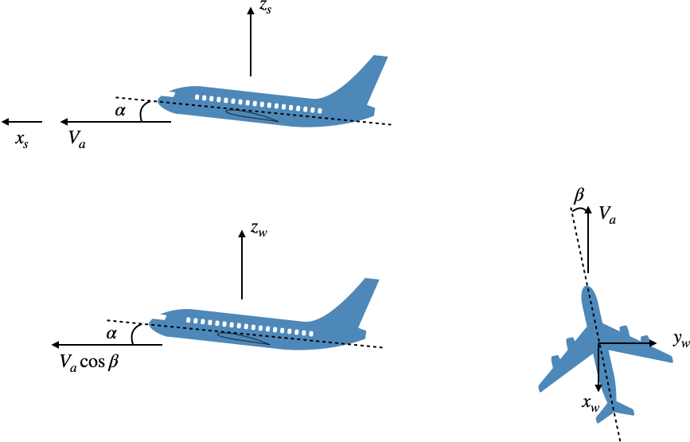
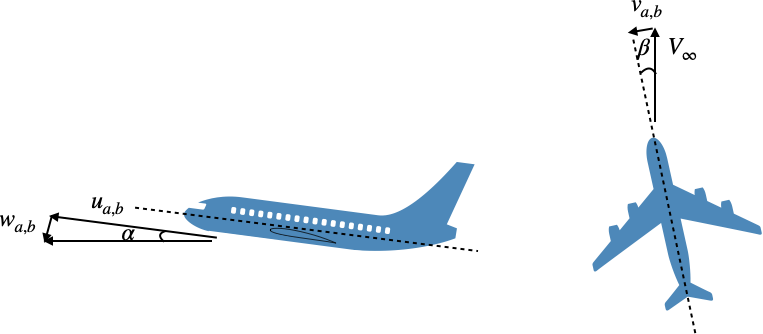

# Theory

## Introduction

This nonlinear sixDOF model uses aircraft conventions as that is our target application.  Although the model is fairly general, some extensions may be needed for other applications (derivatives of moment of inertia tensor for morphing aircraft, quaternions and gravitational moments for spacecraft).

## State and Coordinate Systems

Two main coordinate systems are used in this analysis as depicted below.  The first is the inertial frame ``(x_i, y_i, z_i)``, fixed to the ground [^1], centered at some arbitrary reference point (sometimes this coordinate system is referred to as north-east-down).  The second is the body frame ``(x_b, y_b, z_b)``, fixed to the moving and rotating vehicle, centered at the vehicle's center of mass.  A third coordinate system will be introduced later in connection with aerodynamics.



The aircraft has 12 state variables: the linear and angular positions and the linear and angular velocities.  
```math
s = [x, y, z, \phi, \theta, \psi, u, v, w, p, q, r]^T
```
The positions are defined in the inertial frame, while the velocities are defined in the body frame.  The rotational velocities ``p, q, r`` correspond to roll, pitch, and yaw rates respectively.  

Although there are twelve state variables, there are only six indepedent degrees of freedom (hence the name SixDOF).  The other six constraints are purely kinematic relationships enforcing consistency between positions and velocities.

We define the angular orientation of the vehicle using Euler angles.  Euler angles are not unique. We use a typical representation with the following order from the inertial axis to the body axis:
1. rotate ``\psi`` radians about the inertial z-axis
2. rotate ``\theta`` radians about the new y-axis
3. rotate ``\phi`` radians about the new x-axis.
The resulting rotations will then align with the body axis.  The two coordinate systems will generally still differ by a translation.  For the calculations here, like transfering velocity vectors between the frames, the translation offset is irrelevant.

The resulting rotation matrix from inertial to body is (see Beard and McLain for derivation [^2]:
```math
R_{i \rightarrow b} = 
\begin{bmatrix}
\cos\theta\cos\psi & \cos\theta\sin\psi & -\sin\theta \\
\sin\phi\sin\theta\cos\psi - \cos\phi\sin\psi & \sin\phi\sin\theta\sin\psi + \cos\phi\cos\psi & \sin\phi\cos\theta \\
\cos\phi\sin\theta\cos\psi + \sin\phi\sin\psi & \cos\phi\sin\theta\sin\psi - \sin\phi\cos\psi & \cos\phi\cos\theta
\end{bmatrix}
```
This matrix is orthogonal so its inverse is its transpose.  In other words the rotation matrix from body to inertial is the transpose of above:
```math
R_{b \rightarrow i} = R_{i \rightarrow b}^T
```
The downside of Euler angles is that there is a singularity.  For this particular order that singularity occurs at a ``\theta`` (associated with pitch) of ``\pm 90^\circ``.  At that state, the yaw angle is not unique, a phenomenon known as gimbal lock.  The avoid this issue, quaternions are commonly used.  For spacecraft such pitch angles would be normal and thus this would be an important consideration.  For now, we are only simulating aircraft so the simplicity of Euler angles is justified.

## Kinematics and Dynamics

We now need to compute derivatives of all state variables in order to formulate an ODE.

The first two relationships are simply kinematic relationships between positions and velocities.  The derivative of the vehicle's position (``\vec{r_i} = [x, y, z]^T``) is just the vehicle's velocity (``\vec{V_b} = [u, v, w]^T``).  However, position is defined in the inertial frame, whereas the velocity is given in the body frame.  Thus, a rotation matrix is needed.
```math
\frac{d \vec{r_i}}{dt} = R_{b \rightarrow i} \vec{V_b}
```

Next, we need the derivatives of the Euler angles.  The procedure is the same as above, except that the Euler angles are defined across four different coordinate systems consisting of the body frame, inertial frame, and two intermediate frames between those two (see above definition of Euler angles).  The details are just coordinate transformations, but are a bit tedious and so are not repeated here (see [^2] for derivation).  The result is:
```math
\begin{bmatrix}
\dot{\phi} \\
\dot{\theta} \\
\dot{\psi} \\
\end{bmatrix}
=
\begin{bmatrix}
1 & \sin\phi\tan\theta & \cos\phi\tan\theta \\
0 & \cos\phi & -\sin\phi \\
0 & \sin\phi/\cos\theta & \cos\phi/\cos\theta \\
\end{bmatrix}
\begin{bmatrix}
p \\
q \\
r \\
\end{bmatrix}
```

Now we need to resolve the dynamics. We start with the linear velocity: ``\vec{V_b} = [u, v, w]^T``.  We can apply Newton's second law to the motion of the vehicle as follows:
```math
\vec{F} = m \frac{d \vec{V}}{dt_i}
```
where the derivative is in an inertial frame.  Newton's laws are only applicable in an inertial frame of reference. If a reference frame ``b`` is rotating relative to an inertial frame ``i`` then the time derivative of any vector ``\vec{v}`` can be described as:
```math
\left.\frac{d \vec{v}}{dt}\right|_i + \left.\frac{d \vec{v}}{dt}\right|_b + \vec{\omega}_{b/i} \times \vec{v}
```
where ``\vec{\omega}_{b/i}`` is the rotation of reference frame ``b`` relative to ``i``.

We transform Newton's law to the body frame using the relationship from above.
```math
\vec{F} = m \left( \frac{d\vec{V}}{dt_b} + \vec{\omega}_{b/i} \times \vec{V} \right)
```
We can evaluate these forces/velocities in any frame, but the most convenient will be the body frame:
```math
\vec{F_b} = m \left( \frac{d\vec{V_b}}{dt_b} + \vec{\omega_b} \times \vec{V_b} \right)
```
Since the end goal is an ODE and so we solve for ``dV_b/dt_b``:
```math
\frac{d \vec{V_b}}{dt_b} = \frac{\vec{F_b}}{m} - \vec{\omega_b} \times  \vec{V_b}
```
where ``\vec{\omega_b} = [p, q, r]^T``.

We follow a similar procedure for the rotational motion.
```math
\begin{aligned}
\vec{M} &= \frac{d\vec{H}}{dt_i}\\
 &= \frac{d\vec{H}}{dt_b} + \vec{\omega}_{b/i} \times \vec{H} \\
 &= \frac{d\vec{H_b}}{dt_b} + \vec{\omega_b} \times \vec{H_b} \\
\end{aligned}
```

The angular momentum is given by:
```math
\begin{aligned}
\vec{H} &= I \vec{\omega}\\
\vec{H_b} &= I_b \vec{\omega_b}
\end{aligned}
```
where ``I_b`` is the moment of inertia tensor defined in the body axis.
```math
I = 
\begin{bmatrix}
I_{xx} & -I_{xy} & -I_{xz} \\
-I_{xy} & I_{yy} & -I_{yz} \\
-I_{zx} & -I_{zy} & I_{zz} 
\end{bmatrix}
```
(note the minus signs on the off-diagonal components).  The diagonal components of the tensor are given by:
```math
I_{xx} = \int (y^2 + z^2) dm
```
and the off-diagonal components are given by:
```math
I_{xy} = \int xy dm
```
Most aircraft are symmetric about the y-axis and so typically ``I_{xy} = I_{yz} = 0``.

We now plug the definition of the angular moment back into Newton's law.  Unless, the aircraft is able to morph, the inertia tensor is constant in the body frame and so the equation becomes:
```math
\vec{M_b} = I_b \frac{d\vec{\omega_b}}{dt_b} + \vec{\omega_b} \times I_b \vec{\omega_b}
```
We solve for the derivative of the angular velocity:
```math
\frac{d\vec{\omega_b}}{dt_b} = I_b^{-1} \left(\vec{M_b} - \vec{\omega_b} \times I_b \vec{\omega_b} \right)
```
Note, that although a matrix inverse was written, in numerical implementation a linear solve would be used rather than an explicit inversion.


## Forces/Moments

The primary forces and moments on the aircraft are from aerodynamics, propulsion, and gravity.  The former two are outside the scope of the dynamics module, although simple default implementations will be discussed.  The latter is straightforward.  Gravity always acts about the vehicle's center of mass [^3], and so cannot create any moments on the vehicle.  Based on our above derivation we need forces/moments to be specified in the body frame.

### Gravity

In the inertial frame gravity is in the positive z direction (recall that positive z is down).  Thus we just need to apply a rotation to the body frame:
```math
F_g = R_{i \rightarrow b}
\begin{bmatrix}
0 \\
0 \\
mg \\
\end{bmatrix}
```
For our choice of Euler angles we can write this out explicitly as:
```math
\begin{bmatrix}
-mg \sin\theta \\
mg \sin\phi\cos\theta \\
mg \cos\phi\cos\theta \\
\end{bmatrix}
```

### Aerodynamics (General)

Aerodynamic behavior is relative to the local freestream ``V_\infty``.  The local freestream, is the negative of what is referred to as true airspeed, and the true airspeed is ground speed minus wind speed.  
```math
\vec{V_\infty} = -\vec{V_{a}} = -(\vec{V_g} - \vec{V_w})
```
Ground speed, in the body frame is ``\vec{V_g} = \vec{V_b} = [u, v, w]^T``.  For convenience, we allow the user to define a portion of the wind in the inertial frame and a portion in the body frame if desired.  The former would typically be steady-state winds, and the latter would typically represent gusts.  While an aerodynamicist uses the freestream, we will use dynamics convention and use the vehicle's airspeed instead (just a change in sign):
```math
\vec{V_a}_b =  \vec{V_{b}} - \left( R_{i \rightarrow b} \vec{V_{wi}} + \vec{V_{wb}}\right)
```

Aerodynamics requires an additional coordinate system: the wind frame.  Actually, we need one more intermediate frame, the stability frame, which occurs between the body frame and the wind frame.  Again, we adopt dynamics convention (aerodynamics convention uses the opposite sign for the x and z axes).  These two coordinate systems are depicted below.  The top figure shows the stability frame.  It is rotated about the body y-axis axis by the angle of attack ``\alpha``.  The bottom two figures depict the wind axis.  It is rotated about the stability z-axis by the sideslip angle ``\beta``.  The coordinate transformation from wind to body axes (the direction we will usually go) is thus:
```math
\begin{bmatrix}
\cos\alpha \cos\beta & -\cos\alpha \sin\beta & -\sin\alpha \\
\sin\beta & \cos\beta & 0 \\
\sin\alpha \cos\beta & -\sin\alpha \sin\beta & \cos\alpha \\
\end{bmatrix}
```
(and the transformation from body to wind axes is the transpose of this).



The airspeed vector in the wind axes is:
```math
\vec{V_a}_w = (V_a, 0, 0)
```
From the definitions, either using the figure, or the coordinate transformation we can see that the airspeed vector in the body frame is then:
```math
\vec{V_a}_b = V_a 
\begin{bmatrix}
\cos\alpha\cos\beta\\
\sin\beta \\
\sin\alpha\cos\beta
\end{bmatrix}
```
We see that the airspeed is the magnitude of this vector
```math
V_a = ||\vec{V_a}_b||_2
```
If we call the components of the airspeed in the body frame as follows: ``\vec{V_a}_b = [u_a, v_a, w_w]^T`` then the angle of attack and sideslip angles are given by:
```math
\alpha = \tan^{-1}\left(\frac{w_a}{u_a}\right)
```
```math
\beta = \sin^{-1}\left(\frac{v_a}{V_a}\right)
```
These calculations may also be visualized from the figure below.



Because we have used dynamic conventions, we need to be careful to translate the aerodynamic forces properly.  Lift, side force, and drag, would be defined with the following signs using the dynamics wind frame:
```math
{F_{aero}}_w = [-D, Y, -L]
```
Notice that drag and lift are defined in opposite directions from the dynamics positive coordinate directions.

Aerodynamic moments are typically also defined in the stability or wind axes, and so would be defined as follows using the dynamics wind frame.
```math
{M_{aero}}_w = [\mathcal{L}, M, N]
```
where the moments are rolling, pitching, and yaw respectively. Note that the rolling moment and yawing moment do not require any sign changes as the aerodynamic directions follow the same as used in dynamics.

### Aerodynamics (a specific implementation)

Everything up to this point defines the 6DOF simulator.  The aerodynamics, propulsion, and other forces/moments if applicable, are specific to the model choice.  As a simple default a conventional ``linear'' aerodynamics model is included.  This model we use is actually not strictly linear, particuarly in the case of drag, which is fundamentally nonlinear.  Arguably, that addition is negliglbe as aircraft drag typically plays a negligible role in its dynamic behavior.


We define the aerodynamic forces and moments using stability derivatives and control derivatives. The control deflections include ``[\delta f, \delta e, \delta r, \delta a]`` for flaps, elevator, rudder, and aileron respectively.

For lift:
```math
C_L = {C_L}_0 + \frac{d C_L}{d\alpha}\alpha + \frac{d C_L}{dq} \frac{q c}{2 V_a} + \frac{d C_L}{dM}M + \frac{d C_L}{d \delta f}\delta f + \frac{d C_L}{d \delta e}\delta e
```
where ``Mach`` is the Mach number.  A maximum and minimum ``C_L`` is also enforced (a very crude approximation of stall) via ``{C_L}_{max}`` and ``{C_L}_{min}``.

Drag is a combination of parasitic, induced, and compressibility drag.  The parasitic drag coefficient is proportional to a skin friction coefficient ``{C_D}_f``, which is Reynolds number dependent.  For laminar flow (Blasisus solution):
```math
{C_D}_f \propto \frac{1}{\sqrt{Re}}
```
For turbulent flow no such analytic solution exists, various empirical relationships exists such as the Schlichting formula:
```math
{C_D}_f \propto \frac{1}{Re^{0.2}}
```
We assume that the kinematic viscosity does not change appreciably throughout the trajectory and so the Reynolds number scaling only changes with the flight speed.  We can then define the parasitic drag as:
```math
{C_D}_p = {C_D}_0 \left(\frac{V_a}{V_{ref}}\right)^{-k}
```
where ``{C_D}_0`` is the zero-lift drag coefficient, and the second term is the Reynolds number correction based on the reference speed ``V_{ref}`` (corresponding to the Reynolds number at which ``{C_D}_0`` was computed at, and an exponent for the skin friction coefficnet: ``k = 0.5`` for laminar and ``k = 0.2`` for turbulent.

The induced drag is given by its standard definition:
```math
{C_D}_i = \frac{C_L^2}{\pi AR e}
```
where ``e`` is Oswald's efficiency factor, and the aspect ratio uses the reference dimensions of the aircraft (span and area).

Compressibility drag uses an simple empirical quartic drag rise after the crest-critical Mach number:
```math
{C_D}_c = 20(M - M_{cc})^4
```

The parasitic drag is the sum of these three components plus that from control deflections.  An absolute value must be used for the control parts as deflections in either direction would increase drag.

```math
{C_D} = {C_D}_p + {C_D}_i + {C_D}_c + \left|\frac{d C_D}{d \delta f}\delta f\right| + \left|\frac{d C_D}{d \delta e}\delta e\right| + \left|\frac{d C_D}{d \delta a}\delta a\right| + \left|\frac{d C_D}{d \delta r}\delta r\right|
```


### Propulsion

TODO

[^1]: The earth is not, strictly speaking, an inertial frame since it is rotating and so objects on the surface are accelerating.  However, for our applications including the inertial effect is negligible.
[^2]: Small Unmanned Aircraft: Theory and Practice, Randal W. Beard and Timothy W. McLain, Princeton University Press, 2012.
[^3]: Actually it acts about the center of gravity, but in practice these are the same.  The only time we'd see a noticeable difference is if the vehicle was extremely large, or if this was a satellite then the very small gravitational moments might be important in its dynamics.